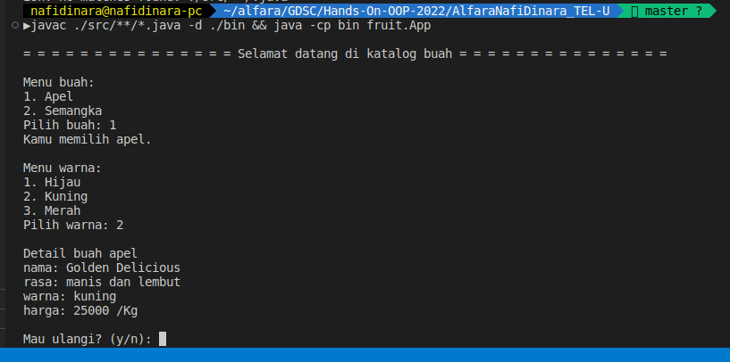

<div align="center" id="top"> 
  
  &#xa0;
</div>

<h1 align="center">Fruit Catalog</h1>

<!-- Status -->

<!-- <h4 align="center"> 
	🚧  Hands On OOP 2022 🚀 Under construction...  🚧
</h4> 

<hr> -->

<br>

## :dart: About ##

Program ini digunakan untuk melihat daftar buah buahan yang tersedia dan informasi detailnya. Terdapat beberapa pilihan dari jenis buah dan warna buah. Program ini masih bisa dikembangkan lebih lanjut dan bukan bentuk final.

## :sparkles: Design Pattern ##

Program ini menggunakan <b>Abstract Factory Design Pattern</b> yaitu sebuah Creational Design Pattern yang memberikan implementasi objek beserta family objek terkait berdasrkan input. Terdapat dalam <code>FruitFactory.java</code>,<code>WatermelonFactory.java</code>, dan <code>AppleFactory.java</code>. Disitu program akan me return class sesuai dengan inputan dari user.

## :sparkles: SOLID Implementation ##

Pada program ini saya mencoba memnerapkan <b>Single-Responsibility Principle</b> yang artinya Setiap class hanya memiliki satu tugas, sehingga alasan untuk merubah class tersebut hanya satu, yaitu merubah tugas yang diberikan kepadanya. Terdapat pada <code>GreenWatermelon.java</code>,<code>YellowWatermelon.java</code>, <code>RedWatermelon.java</code> dan begitupun pada buat apel.

## :rocket: Technologies & Dependecies ##

The following tools were used in this project:

- [Java JDK-19](https://jdk.java.net/19/)


## :checkered_flag: Starting ##

```bash
# Clone this project
$ git clone https://github.com/nafidinara/hands-on-oop-2022

# Access
$ cd hands-on-oop-2022

# path to project
$ cd AlfaraNafiDinara_TEL-U

# Run the project
$ javac ./src/*/.java -d ./bin && java -cp bin fruit.App
```

## :memo: License ##

Program ini memiliki inputan interactive dari user.


Made with :heart: by <a href="https://github.com/nafidinara" target="_blank">Alfara Nafi Dinara</a>

&#xa0;

<a href="#top">Back to top</a>
