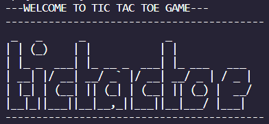

# Basic Tic Tac Toe
> Source Code ini dibuat oleh saya, Austin Gabriel Pardosi, untuk memenuhi Tugas Hands On Object Oriented Programming GDSC 2022  yaitu mengimplementasikan 
> Game Basic Tic Tac Toe menggunakan bahasa pemrograman C++

## Daftar Isi
* [Sistematika File](#sistematika-file)
* [Screenshots](#screenshots)
* [Developed by](#creator)

## Sistematika File
*On Progress*
```bash
.
├─── board.cpp
├─── board.h
├─── main.cpp
├─── player.cpp
├─── player.h
└─── README.md
```

## Screenshots
*On Progress*


## Creator
* Austin Gabriel Pardosi
* 13521084@std.stei.itb.ac.id