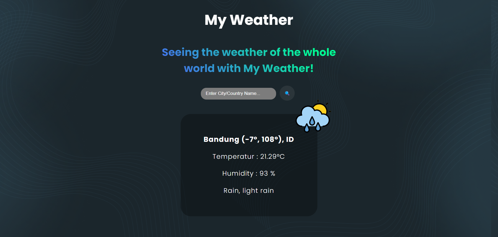

### Deskripsi program

Website ini bertujuan untuk mengecek suhu dari berbagai kota dengan menggunakan API dari [OpenWeather](openweathermap.org)

#### Cara Menjalankan Program

- npm install
- deno task dev

Selain itu dapat dilihat melalui

#### Design Pattern yang dipilih

- Factory : Design Pattern ini terdapat pada (DataFactory.ts), dan hal ini bertujuan apabila membutuhkan membuat provider lagi, kita hanya perlu untuk mengakses providerFactory, tidak perlu membuat classnya satu per satu
- Factory Method is a creational design pattern that provides an interface for creating objects in a superclass, but allows subclasses to alter the type of objects that will be created.

- Adapter : Design Pattern ini terdapat pada (DataAdapter.ts), dan hal ini bertujuan dalam menyesuaikan data dari "WeatherDataProvider" ke format umum agar dapat digunakan oleh lainnya. Dengan design pattern Adapter memungkinkan untuk bekerja dengan data providers yang berbeda tanpa harus mengubah seluruh provider.
- Adapter is a structural design pattern that allows objects with incompatible interfaces to collaborate.

#### Solid principles

- Single Responsibility
- Interface Segregation
- Dependency Inversion

#### Versi bahasa dan dependency

Program ini menggunakan bahasa typescript
Dependency yang digunakan adalah axios dan @types/node

#### Konsep lainnya yang digunakan

1. Generics
2. Interactive program
3. Stream API
4. Hosting
5. Functional Programming
6. Deno
7. Web Builder(Vite)
8. Dapat dibuka langsung melalui link diatas
